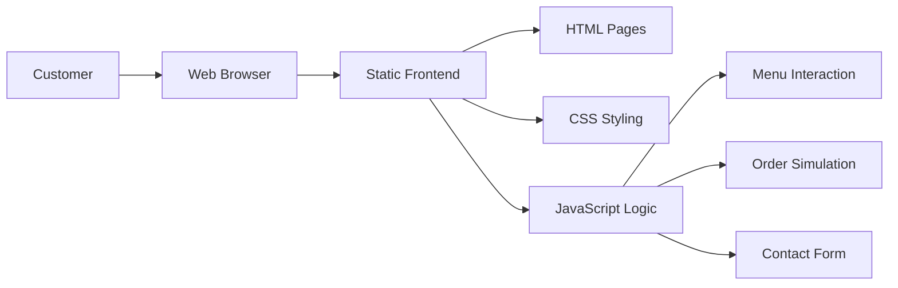

# Coffee Shop Frontend

A polished frontend website for a coffee shop, built with HTML, CSS, and JavaScript. This project delivers a smooth customer experience with responsive design, interactive menu cards, and a modern shop interface.

## ✨ What’s Included

- **Responsive layout** for desktop, tablet, and mobile
- **Interactive menu cards** with rich product details
- **Order-ready UI** for fast customer flow
- **Smooth transitions** and polished styling
- **Contact & shop info** for improved engagement

## 🧠 Architecture Overview



## 🚀 Tech Stack

- **HTML5** — semantic structure and accessible markup
- **CSS3** — responsive styling using Flexbox and Grid
- **JavaScript (ES6+)** — interactive behavior and DOM updates

## 📁 Project Structure

```text
coffee-frontend/
├── index.html          # Main landing page and shop interface
├── style.css           # Styles, layout, and responsive design
├── script.js           # Dynamic menu behavior and interaction
├── README.md           # Project documentation
└── Coffee-Shop/        # Additional assets or subpages
```

## 🛠️ Installation

1. Clone the repository:
   ```bash
   git clone https://github.com/akashray398/coffee-frontend.git
   ```

2. Navigate to the project directory:
   ```bash
   cd coffee-frontend
   ```

3. Open `index.html` in your browser:
   ```bash
   start index.html
   ```

## 🎯 Usage

- Launch `index.html` to open the coffee shop frontend
- Explore featured drinks and menu categories
- Use the interface to simulate ordering and contact the shop

## 💡 Design Highlights

- **Modern UI** with clear typography and spacing
- **Mobile-first experience** for quick browsing
- **Fast static performance** on any device
- **Friendly user flow** for visitors and customers

## 🤝 Contributing

Contributions are welcome!

1. Fork the repository
2. Create a feature branch:
   ```bash
   git checkout -b feature/your-idea
   ```
3. Commit your improvements:
   ```bash
   git commit -m "Add feature"
   ```
4. Push your branch:
   ```bash
   git push origin feature/your-idea
   ```
5. Create a pull request on GitHub

## 📄 License

This project is licensed under the MIT License.

## 📬 Contact

For questions or suggestions, open an issue on GitHub.

---

*Made for coffee lovers and creative frontend developers ☕️*
